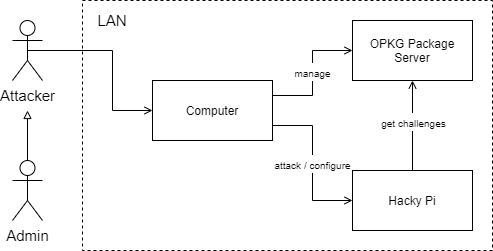

# Hacky Pi :robot:
This project is about providing a minimal Raspberry Pi image with opkg support which enables a user to install various **security challenge packages**.
The list of currently available challenges can be found [here](challenges/readme.md).


# Build Image
(Tested on Ubuntu 20.04 LTS)
1. `./setup.sh`
1. `source poky/oe-init-build-env`
1. `bitbake hackypi-image`
1. take `xxx.rpi-sdimg` from `build/tmp/deploy/images/raspberrypi4/` and write it to SD card
1. startup Raspberry Pi and connect via UART or SSH


# Build & install a package
1. `bitbake <PACKAGE_NAME>` to build a package
1. setup an opkg package server (e.g. this one: [https://github.com/nimarty/docker-private-opkg-repo]()) which points to ipk build directory.
1. configure the opkg repository on the Raspberry Pi. Append the following line at the bottom of `/etc/opkg/opkg.conf`
```
src/gz hackypackages http://<SERVER_URL>:<PORT>
```
1. run `opkg update` to update local package list
1. run `opkg install <PACKAGE_NAME>` to install a package

# Network Setup



- Hacky Pi, Package Server and Attacker's/Admin's computer have to be in the same LAN
- The Admin configures the Hacky Pi by installing packages
- The Attacker tries to solve the challenge
